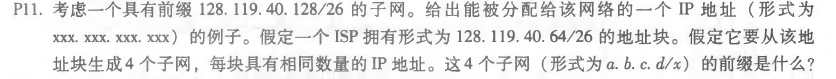
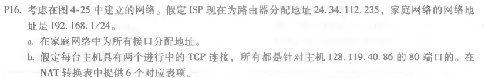
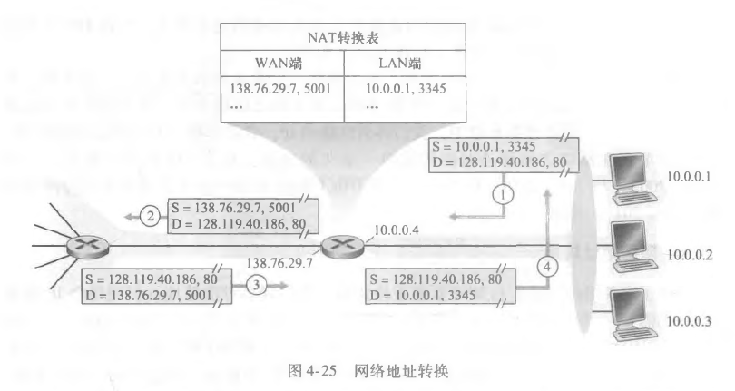

2017301533080 王润泽

---

### P6

| 范围              | 接口 | 数量 |
| ----------------- | ---- | ---- |
| 00000000-00111111 | 0    | 64   |
| 01000000-01011111 | 1    | 32   |
| 01100000-10111111 | 2    | 96   |
| 11000000-11111111 | 3    | 64   |

### P11

可知该地址的子网部分有26位，主机部分有64位，那么IP地址在128.119.40.128到128.119.40.191范围都可以分配。

四个具有相同数量IP地址的子网：

 128.119.40.64/28   128.119.40.80/28  

 128.119.40.96/28      128.119.40.112/28 

###  P16

a. 

家庭主机地址：192.168.1.1、192.168.1.2、192.168.1.3

路由器地址：192.168.1.4

b.

| WAN                 | LAN               |
| ------------------- | ----------------- |
| 24.34.112.235，5001 | 192.168.1.1，3345 |
| 24.34.112.235，5002 | 192.168.1.1，3346 |
| 24.34.112.235，5003 | 192.168.1.2，3345 |
| 24.34.112.235，5004 | 192.168.1.2，3346 |
| 24.34.112.235，5005 | 192.168.1.3，3345 |
| 24.34.112.235，5006 | 192.168.1.3，3346 |

