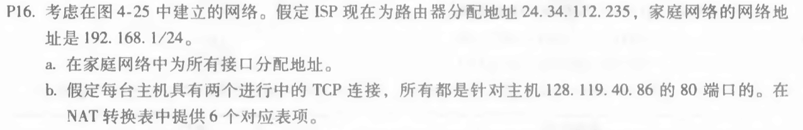
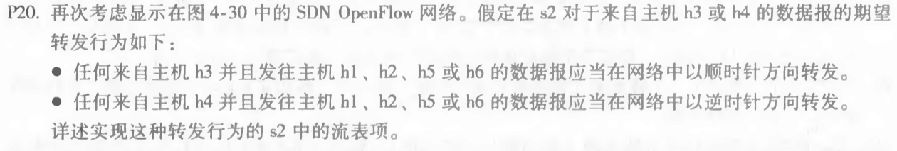

1. 第一题

   * 题目

     

   * 解答

     + a:

       家庭：192.168.1.1，192.168.1.2，192.168.1.3

       路由器接口：192.168.1.4

     + b:

       NAT转换表：

       |        WAN端        |       LAN端       |
       | :-----------------: | :---------------: |
       | 24.34.112.235，4000 | 192.168.1.1，3345 |
       | 24.34.112.235，4001 | 192.168.1.1，3346 |
       | 24.34.112.235，4002 | 192.168.1.2，3345 |
       | 24.34.112.235，4003 | 192.168.1.2，3346 |
       | 24.34.112.235，4004 | 192.168.1.3，3345 |
       | 24.34.112.235，4005 | 192.168.1.3，3346 |

       

2. 第二题

   * 题目

     

   * 解答

     |                 匹配                 |    动作    |
     | :----------------------------------: | :--------: |
     | Ingress Port = 3;IP Dst = 10.1. *. * | Forward(2) |
     | Ingress Port = 3;IP Dst = 10.3. *. * | Forward(2) |
     | Ingress Port = 4;IP Dst = 10.1. *. * | Forward(1) |
     | Ingress Port = 4;IP Dst = 10.3. *. * | Forward(1) |

3. 第三题

   * 题目

     

   * 解答

     + |                匹配                 |    动作    |
       | :---------------------------------: | :--------: |
       | IP Src = 10.1.0.1;IP Dst = 10.2.0.3 | Forward(3) |
       | IP Src = 10.3.0.1;IP Dst = 10.2.0.4 | Forward(4) |
       | IP Src = 10.1.0.6;IP Dst = 10.2.0.3 | Forward(3) |
       | IP Src = 10.3.0.6;IP Dst = 10.2.0.4 | Forward(4) |

     + |             匹配             |    动作    |
       | :--------------------------: | :--------: |
       | IP Dst = 10.2.0.3;port = TCP | Forward(3) |
       | IP Dst = 10.2.0.4;port = TCP | Forward(4) |

     + |       匹配        |    动作    |
       | :---------------: | :--------: |
       | IP Dst = 10.2.0.3 | Forward(3) |

     + |                      匹配                      |    动作    |
       | :--------------------------------------------: | :--------: |
       | IP Src = 10.1.0.1;IP Dst = 10.2.0.3;port = UDP | Forward(3) |

       