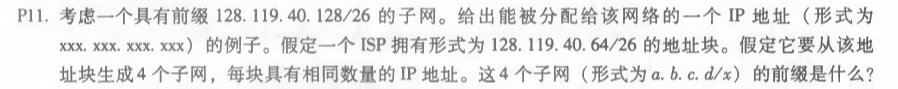
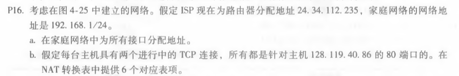
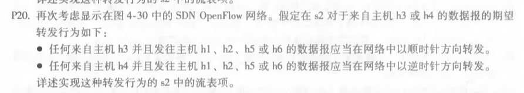

# 网络及分布式计算第八次作业

#### 2017302580018  刘佳媚

---

### 1、P11

  解：

IP地址：128.119.40.130

4个子网前缀：128.119.40.64/28，128.119.40.80/28，128.119.40.96/28，128.119.40.112/28。

​        

------

### 2、P16

  解：

a、家庭地址：192.168.1.1，192.168.1.2，192.168.1.3   路由器接口地址：192.168.1.4

|WAN端|LAN端|
|------|---|
|24.34.112.235，5001 |192.168.1.1，3345|
|24.34.112.235，5002 |192.168.1.1，3346|
|24.34.112.235，5003| 192.168.1.2，3345 |
|24.34.112.235，5004 |192.168.1.2，3346|
|24.34.112.235，5005 | 192.168.1.3，3345 |
|24.34.112.235，5006 | 192.168.1.3，3346 |

---

### 3、P20

  解：

| 匹配                                   | 动作       |
| -------------------------------------- | ---------- |
| Ingress Port = 3; IP Dst =  10.1.\*.\* | Forward(2) |
| Ingress Port = 3; IP Dst =  10.3.\*.\* | Forward(2) |
| Ingress Port = 4; IP Dst =  10.1.\*.\* | Forward(1) |
| Ingress Port = 4; IP Dst =  10.3.\*.\* | Forward(1) |

