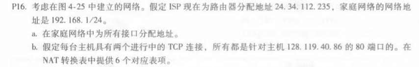
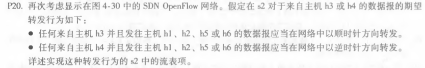
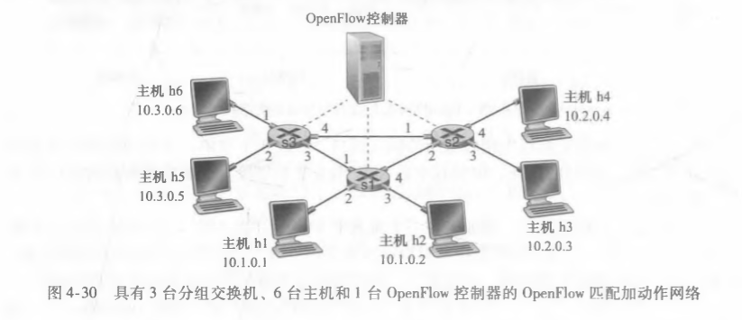
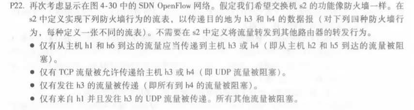

# homework8

​										*马克*

#### 计算机网络（自顶向下）中文版课后练习（电子版p255起，书本p238起）

###### p16

答：

a）家庭地址：192.168.1.1，192.168.1.2，192.168.1.3，路由器接口地址192.168.1.4.

b）

| WAN Side            | LAN Side          |
| ------------------- | ----------------- |
| 24.35.112.235，4000 | 192.168.1.1，3345 |
| 24.35.112.235，4001 | 192.168.1.1，3346 |
| 24.35.112.235，4002 | 192.168.1.2，3345 |
| 24.35.112.235，4003 | 192.168.1.2，3346 |
| 24.35.112.235，4004 | 192.168.1.3，3345 |
| 24.35.112.235，4005 | 192.168.1.3，3346 |

###### 

###### p20

| 匹配                            | 动作       |
| ------------------------------- | ---------- |
| ingress Port=3;ip Dst=10.1.\*.* | forward(2) |
| ingress Port=3;ip Dst=10.3.\*.* | forward(2) |
| ingress Port=4;ip Dst=10.1.\*.* | forward(1) |
| ingress Port=4;ip Dst=10.3.\*.* | forward(1) |

###### p22

1.

| 匹配                             | 动作       |
| -------------------------------- | ---------- |
| ip src=10.1.0.1；ip dst=10.2.0.3 | forward(3) |
| ip src=10.1.0.1；ip dst=10.2.0.4 | forward(4) |
| ip src=10.3.0.6；ip dst=10.2.0.3 | forward(3) |
| ip src=10.3.0.6；ip dst=10.2.0.4 | forward(4) |

2.

| 匹配                                       | 动作       |
| ------------------------------------------ | ---------- |
| ip src=\*.\*.\*.*,ip dst=10.2.0.3;port=TCP | forward(3) |
| ip src=\*.\*.\*.*,ip dst=10.2.0.4;port=TCP | forward(4) |

3.

| 匹配                               | 动作       |
| ---------------------------------- | ---------- |
| ip src=\*.\*.\*.*,ip dst=10.2.0.3; | forward(3) |

4.

| 匹配                                     | 动作       |
| ---------------------------------------- | ---------- |
| ip src=10.1.0.1,ip dst=10.2.0.3;port=UDP | forward(3) |

