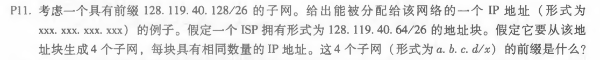
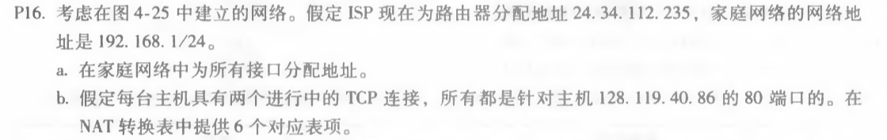

# 网络及分布式计算第八次作业

计算机学院-刁可 -2017302580031

1. P11

   

   前缀128.119.40.128/26的一个子网对应的IP地址范围是128.119.40.128到128.119.40.191。因为26代表前26位是固定的，并且我们可以由128知道最后八位的最高两位是01，所以IP地址对应的最后八位的范围是01 000000到01 111111，即128到191。

   假定它要从该地址块生成4个子网，每块具有相同数量的IP地址。则每个子网对应的地址数目为(191-128)/4，地址后6位范围分别是000000到001111，010000到011111,100000到101111，110000到111111。

   则四个子网的前缀：128.119.40.64/28，128.119.40.80/28，128.119.40.96/28， 128.119.40.112/28.

2. P16

   

   a. 家庭地址：192.168.1.1、192.168.1.2、192.168.1.3，路由器接口为192.168.1.4

   b. NAT 转换表：

   | WAN端              | LAN端            |
   | ------------------ | ---------------- |
   | 24.34.112.235,4000 | 192.168.1.1,3345 |
   | 24.34.112.235,4001 | 192.168.1.1,3346 |
   | 24.34.112.235,4002 | 192.168.1.2,3345 |
   | 24.34.112.235,4003 | 192.168.1.2,3346 |
   | 24.34.112.235,4004 | 192.168.1.3,3345 |
   | 24.34.112.235,4005 | 192.168.1.3,3346 |

3. P19

   

   | 匹配                                                       | 动作       |
   | ---------------------------------------------------------- | ---------- |
   | Ingress Port = 1 ; IP Src = 10.3.0.* ; IP Dst = 10.1.0.* ; | Forward(2) |
   | Ingress Port = 2 ; IP Src = 10.1.0.* ; IP Dst = 10.3.0.* ; | Forward(1) |
   | Ingress Port = 1 ; IP Dst = 10.2.0.3 ;                     | Forward(3) |
   | Ingress Port = 2 ; IP Dst = 10.2.0.3 ;                     | Forward(3) |
   | Ingress Port = 1 ; IP Dst = 10.2.0.4 ;                     | Forward(4) |
   | Ingress Port = 2 ; IP Dst = 10.2.0.4 ;                     | Forward(4) |
   | Ingress Port = 4 ;                                         | Forward(3) |
   | Ingress Port = 3 ;                                         | Forward(4) |

   

   