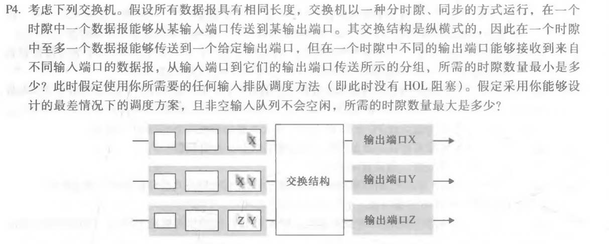
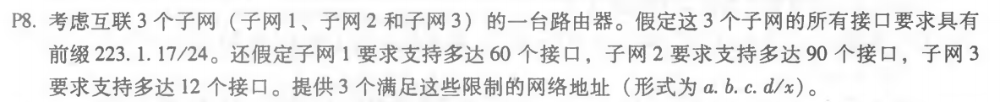

### Chapter4 课后习题（p4；p8；p15）

******

- 所需的最小时隙数量为 3，方案如下

  情况一：

  - 传输【X】中的 X，【XY】中的 Y
  - 传输【XY】中的 X，【ZY】中的 Y
  - 传输【ZY】中的 Z

  情况二：

  - 传输【X】中的 X，【ZY】中的 Y
  - 传输【XY】中的 Y，【ZY】中的 Z
  - 传输【XY】中的 X

- 所需的最大时隙数量为 3。基于非空的假设输入队列从不空闲，第一个时隙总是会传输【X】中的 X，【ZY】中的 Y 或者【XY】中的 Y，以此类推就会得到上述的两种情况。所以所需的最大时隙数量任为 3。

******

- 223.1.17.0/26 （2(32 - 26) = 64 > 60）
- 223.1.17.128/25 （2(32 - 25) = 128 > 90）
- 223.1.17.192/28 （2(32 - 28) = 16 > 12）

******

- MP3 文件的字节大小为：totalBytes = 5 * 106 （byte）
- 每个数据报可携带的数据大小为：bytesOneTime = 1500 - 20 * 2 = 1460 （byte）
- 所需的数据报个数为：count = totalBytes / bytesOneTime = 3425

