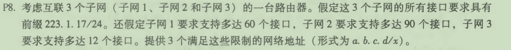
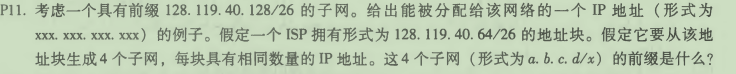
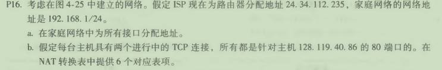

#### p8

由题，可以设计

子网一的网络地址：223.1.17.0/26

子网二的网络地址：223.1.17.128/25

子网三的网络地址：223.1.17.192/28

#### p11

这四个子网的前缀是：

128.119.40.64/28，128.119.40.80/28，

128.119.40.96/28， 128.119.40.112/28。

#### p16

①

路由器接口为192.168.1.4

家庭地址：192.168.1.1、192.168.1.2、192.168.1.3，

②

| WAN端               | LAN端             |
| ------------------- | ----------------- |
| 24.34.112.235：5000 | 192.168.1.1：3345 |
| 24.34.112.235：5001 | 192.168.1.1：3346 |
| 24.34.112.235：5002 | 192.168.1.2：3345 |
| 24.34.112.235：5003 | 192.168.1.2：3346 |
| 24.34.112.235：5004 | 192.168.1.3：3345 |
| 24.34.112.235：5005 | 192.168.1.3：3346 |

