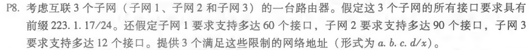
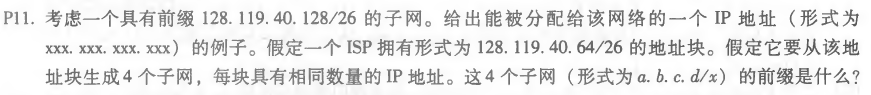
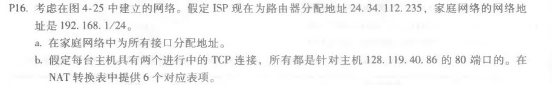

## 第8次作业

### p8



```
① 223.1.17.192/26
② 223.1.17.0/25
③ 223.1.17.240/28
```

### P11



```
（1）128.119.40.130
（2）ISP拥有128.119.40.64/26的地址快，即主机号共2^6=64个，平均每个子网分配16个
IP地址，则4个子网的前缀分别是：
① 128.119.40.64/28
② 128.119.40.80/28
③ 128.119.40.96/28
④ 128.119.40.112/28
```

### P16




```
a.主机地址：
  ①192.168.1.1
  ②192.168.1.2
  ③192.168.1.3
  路由器地址：
  192.168.1.4
```

b.

| WAN端                      | LAN端                 |
| ------------------------- | -------------------- |
| 24.34.112.235        5001 | 192.168.1.1     3345 |
| 24.34.112.235        5002 | 192.168.1.1     3346 |
| 24.34.112.235        5003 | 192.168.1.2     3347 |
| 24.34.112.235        5004 | 192.168.1.2     3348 |
| 24.34.112.235        5005 | 192.168.1.3     3349 |
| 24.34.112.235        5006 | 192.168.1.3     3350 |
