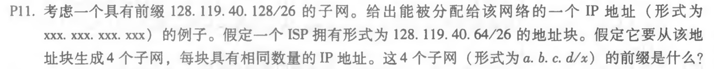
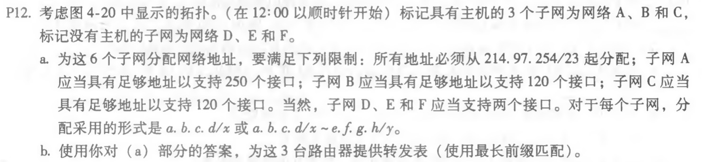
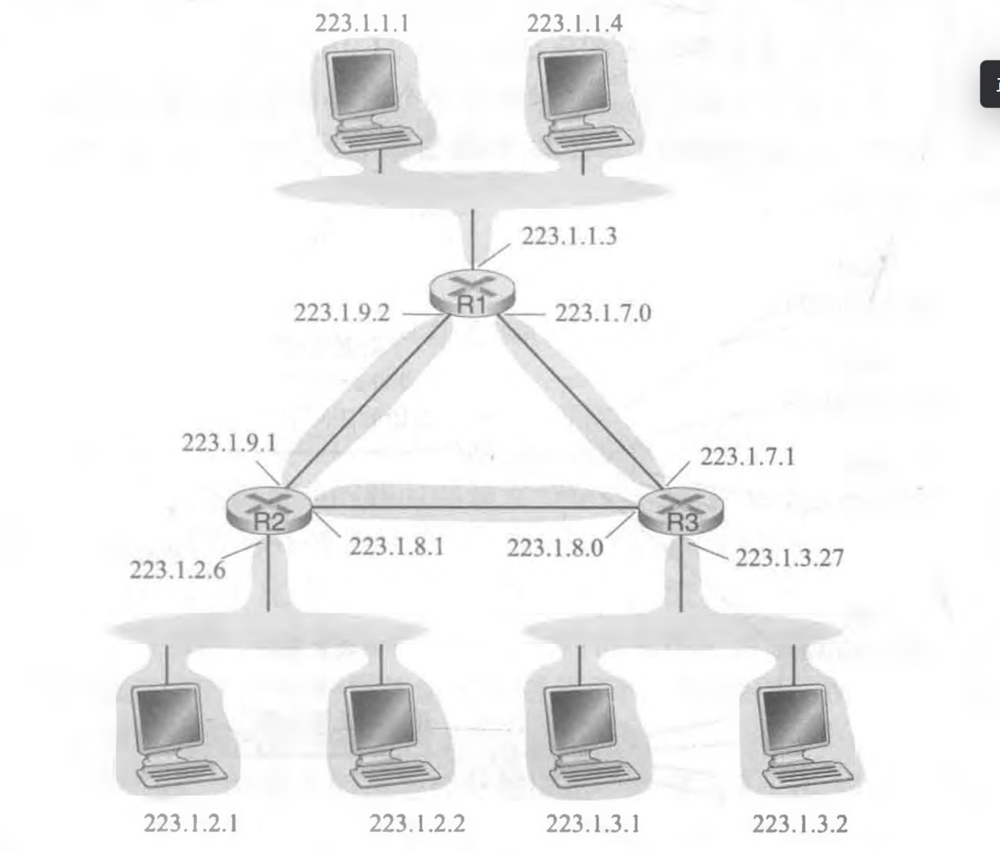
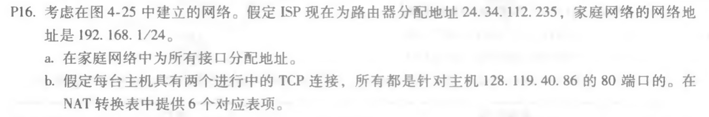
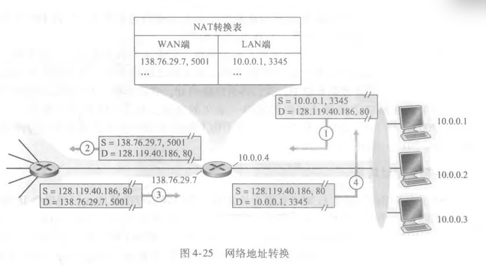

## 第四章习题

4个子网前缀分别为：128.119.40.96/28 , 128.119.40.88/28 , 128.119.40.80/28 ,   128.119.40.72/28

a. 

| 子网 | 地址              |
| ---- | ----------------- |
| A    | 214.97.254.0/24   |
| B    | 214.97.254.128/25 |
| C    | 214.97.254.196/25 |
| D    | 214.97.255.0/31   |
| E    | 214.97.255.2/31   |
| F    | 214.97.255.4/31   |

b.

| 前缀                                        | 接口 |
| ------------------------------------------- | ---- |
| 11010110 01100001 11111111 \*\*\*\*\*\*\*\* | A    |
| 11010110 01100001 11111111 10\*\*\*\*\*\*   | B    |
| 11010110 01100001 11111111 11*\*\*\*\*\*    | C    |

a. 192.168.1.1   192.168.1.2    192.168.1.3

b. 

| WAN端              | LAN端            |
| ------------------ | ---------------- |
| 24.34.112.235 5001 | 192.168.1.1 3345 |
| 24.34.112.235 5002 | 192.168.1.1 3346 |
| 24.34.112.235 5003 | 192.168.1.2 3347 |
| 24.34.112.235 5004 | 192.168.1.2 3348 |
| 24.34.112.235 5005 | 192.168.1.3 3349 |
| 24.34.112.235 5006 | 192.168.1.3 3350 |

