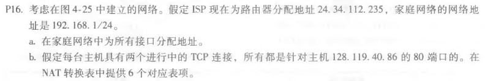
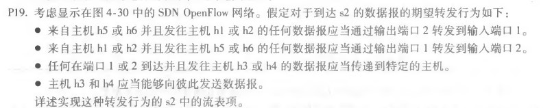

# 网络及分布式计算作业（五）

[toc]

## 课后习题

### P11

1. 128.119.40.128/26的子网：可分配的IP地址的最后一个数的二进制前缀为10，十进制值x满足128<=x<191。

   因此可分配给该子网的IP地址的一个例子可以是：128.119.40.156

2. 要将形为128.119. 40. 64/26的地址块划分为四份，则新的子网掩码为26+2=2。最后一位的二进制前四位依次为0100、0101、0110、0111，因此这四个子网的前缀如下：

   + 128.119. 40. 64/28
   + 128.119. 40. 80/28
   + 128.119. 40. 96/28
   + 128.119. 40. 122/28

### P16

a. 家庭地址：192.168.1.1、192.168.1.2、192.168.1.3，路由器接口为192.168.1.4

b. 一种可能的NAT转换表如下：

|        WAN端        |       LAN端       |
| :-----------------: | :---------------: |
| 24.34.112.235：5000 | 192.168.1.1：3345 |
| 24.34.112.235：5001 | 192.168.1.1：3346 |
| 24.34.112.235：5002 | 192.168.1.2：3345 |
| 24.34.112.235：5003 | 192.168.1.2：3346 |
| 24.34.112.235：5004 | 192.168.1.3：3345 |
| 24.34.112.235：5005 | 192.168.1.3：3346 |

### P19

   四种操作对应的流表项如下：

| 操作 | 匹配项 | 动作 |
| :--: | :--: | :--: |
| ...... | ...... | ...... |
| 操作1 | Ingress Port=1 ; IP Src = 10.3.\*.\* ; IP Dst = 10.1.\*.\* | Forward(2) |
| 操作2 | Ingress Port=2 ;IP Src = 10.1.\*.\* ; IP Dst = 10.3.\*.\* | Forward(1) |
| 操作3 | Ingress Port  = 1 ; IP Dst = 10.2.0.3 | Forward(3) |
| 操作3  |           Ingress Port  = 2 ; IP Dst = 10.2.0.3            | Forward(3) |
| 操作3  |           Ingress Port  = 1 ; IP Dst = 10.2.0.4            | Forward(4) |
| 操作3 | Ingress Port  = 2 ; IP Dst = 10.2.0.4 | Forward(4) |
| 操作4 | Ingress Port  = 3 ; IP Dst = 10.2.0.4 | Forward(4) |
| 操作4 | Ingress Port  = 4 ; IP Dst = 10.2.0.3 | Forward(3) |

