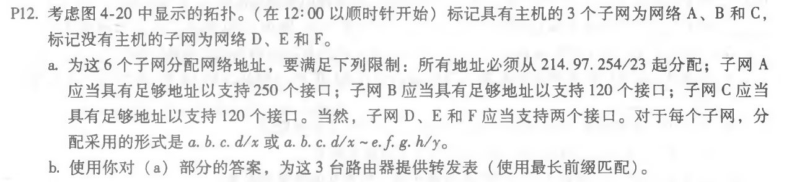
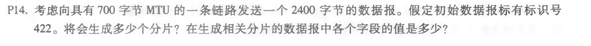
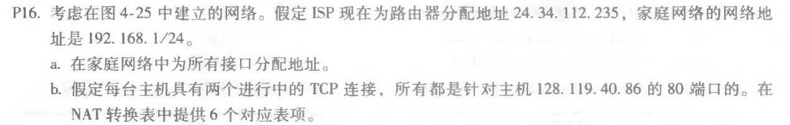
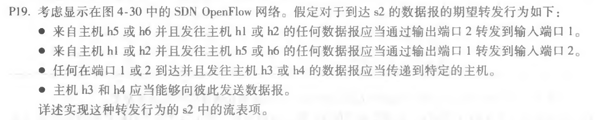

## Homework_8

**Author：**

姓名： 王泽生

学号：2017302580268

第四章习题：**P12、P14、P16、P19**

### P12

**解答：**

a）

| 子网 | 网络地址                                                  |
| ---- | --------------------------------------------------------- |
| A    | 214.97.255/24（256个接口）                                |
| B    | 214.97.254.0/25 - 214.97.254.0/29（128 - 8 = 120 个接口） |
| C    | 214.97.254.128/25（128个接口）                            |
| D    | 214.97.254.0/31（2个接口）                                |
| E    | 214.97.254.2/31（2个接口）                                |
| F    | 214.97.254.4/30（4个接口）                                |

b）

R1：

| 前缀匹配                           | 子网 |
| ---------------------------------- | ---- |
| 11010110 01100001 11111111         | A    |
| 11010110 01100001 11111110 0000000 | D    |
| 11010110 01100001 11111110 000001  | F    |

R2：

| 前缀匹配                           | 子网 |
| ---------------------------------- | ---- |
| 11010110 01100001 11111110 0       | B    |
| 11010110 01100001 11111110 0000000 | D    |
| 11010110 01100001 11111110 0000001 | E    |

R3：

| 前缀匹配                           | 子网 |
| ---------------------------------- | ---- |
| 11010110 01100001 11111110 1       | C    |
| 11010110 01100001 11111110 0000001 | E    |
| 11010110 01100001 11111110 000001  | F    |

### P14

**解答：**

每个数据包的最大数组字段字节为 700 - 20 = 680；

需要的分片数为：（2400 - 20） / 680 向上取整为 4；

每个分片的标识号均为 422；

除了最后一个分片大小为 360 字节，其余分片大小均为 700 字节

4 个分片的偏移分别为：0，85，170，255

除了最后一个分片 flag = 0，其余分片 flag = 1

### P16

**解答：**

a）

家庭地址接口：192.168.1.1、192.168.1.2、192.168.1.3

路由器地址接口：192.168.1.4

b）

NAT 转换表

| WAN端               | LAN端             |
| ------------------- | ----------------- |
| 24.34.112.235, 4000 | 192.168.1.1, 3345 |
| 24.34.112.235, 4001 | 192.168.1.1, 3346 |
| 24.34.112.235, 4002 | 192.168.1.2, 3445 |
| 24.34.112.235, 4003 | 192.168.1.2, 3446 |
| 24.34.112.235, 4004 | 192.168.1.3, 3545 |
| 24.34.112.235, 4005 | 192.168.1.3, 3546 |

### P19

**解答：**

| 匹配                                                         | 动作                                                        |
| ------------------------------------------------------------ | ----------------------------------------------------------- |
| Ingress Port = 1; IP Src = 10.3.\*.\*; IP Dst = 10.1.\*.\*   | Foward(2)                                                   |
| Ingress Port = 2; IP Src = 10.1.\*.\*; IP Dst = 10.3.\*.\*   | Foward(1)                                                   |
| Ingress Port = 1; IP Dst = 10.2.0.3 Ingress Port = 2; IP Dst = 10.2.0.3 Ingress Port = 1; IP Dst = 10.2.0.4 Ingress Port = 2; IP Dst = 10.2.0.4 | Forward (3) Forward (3) Forward (4) Forward (4) |
| Ingress Port = 4 Ingress Port = 3                        | Forward (3) Forward (4)                                 |

