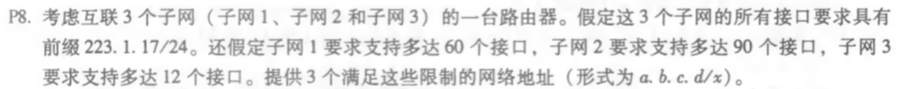
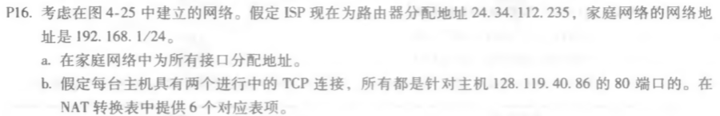
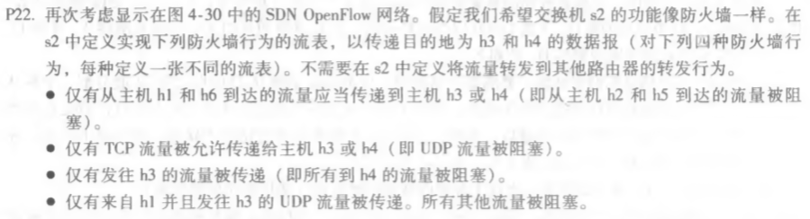
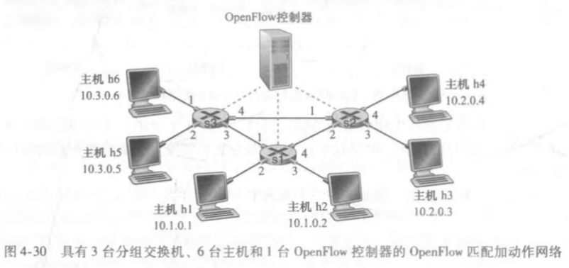

### P8

​	223.1.17.0/26 	223.1.17.128/25 	223.1.17.192/28

### P16

a. 路由器接口为192.168.1.4 几个主机接口为192.168.1.1 192.168.1.2 192.168.1.3

b. NAT转换表

| WAN端 | LAN端 |
| :--: | :--: |
| 24.34.112.235, 6000 | 192.168.1.1,3345 |
| 24.34.112.235, 6001 | 192.168.1.1,3346 |
| 24.34.112.235, 6002 | 192.168.1.2,3345 |
| 24.34.112.235, 6003 | 192.168.1.2,3346 |
| 24.34.112.235, 6004 | 192.168.1.3,3345 |
| 24.34.112.235, 6005 | 192.168.1.3,3346 |

### P22

(1)

| 匹配                                 | 动作       |
| ------------------------------------ | ---------- |
| IP Src = 10.1.0.1; IP Dst = 10.2.0.3 | forward(3) |
| IP Src = 10.1.0.1; IP Dst = 10.2.0.4 | forward(4) |
| IP Src = 10.1.0.6; IP Dst = 10.2.0.3 | forword(3) |
| IP Src = 10.1.0.6; IP Dst = 10.2.0.4 | forward(4) |

(2)

| 匹配                                               | 动作       |
| -------------------------------------------------- | ---------- |
| IP Src =\*.\*.\*.\*; IP Dst = 10.2.0.3; port = TCP | forward(3) |
| IP Src =\*.\*.\*.\*; IP Dst = 10.2.0.4; port = TCP | forward(4) |

(3)

| 匹配                                   | 动作       |
| -------------------------------------- | ---------- |
| IP Src =\*.\*.\*.\*; IP Dst = 10.2.0.3 | forward(3) |

(4)
| 匹配                                   | 动作       |
| -------------------------------------- | ---------- |
| IP Src =10.1.0.1; IP Dst = 10.2.0.3; port = UDP | forward(3) |
