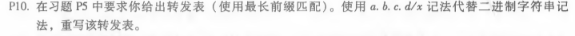
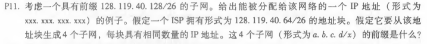
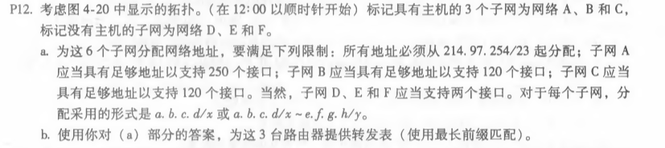

## P10
 
   链连接口 前缀匹配             
   0       11100000 00           
   1       11100000 01000000      
   2       1110000                 
   3       11100001 1              
   3       其他                    
~~~
接口0：224.0/10
接口1：224.64/16
接口2：224/8
接口3：225.128/9 以及其他
~~~

## P11

~~~
1）例如128.119.40.130
2）128.119.40.64/28  
   128.119.40.80/28  
   128.119.40.96/28
   128.119.40.112/28
~~~

## P12

~~~
1）A:214.97.254.0/24
   B:214.97.255.0/25
   C:214.97.255.128/25
   D:214.97.255.0/31
   E:214.97.255.2/31
   F:214.97.255.4/31
2）接口  前缀
R1
   A     11010110 01100001 11111110
   D     11010110 01100001 11111111 0000000
   F     11010110 01100001 11111111 0000010
R2
   D     11010110 01100001 11111111 0000000
   E     11010110 01100001 11111111 0000001
   B     11010110 01100001 11111111 0
R3
   E     11010110 01100001 11111111 0000001
   F     11010110 01100001 11111111 0000010
   C     11010110 01100001 11111111 1
~~~
 

 
刘涛 2017302580292 2020.04.29
