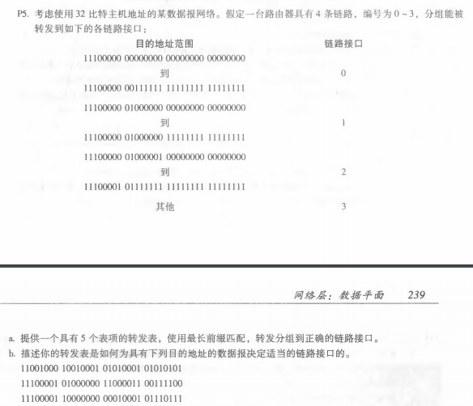
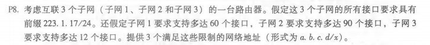
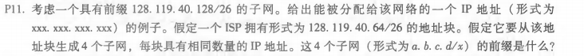

# 第八次作业
## 刘洋 2017302580294
P5: 
(a)、前缀匹配&emsp;&emsp;&emsp;&emsp;链路接口 
11100000&emsp;00&emsp;&emsp;&emsp;&emsp;&emsp;0 
11100000&emsp;01000000&emsp;&emsp;1 
1110000&emsp;&emsp;&emsp;&emsp;&emsp;&emsp;&emsp;2 
11100001&emsp;1&emsp;&emsp;&emsp;&emsp;&emsp;3 
否则&emsp;&emsp;&emsp;&emsp;&emsp;&emsp;&emsp;&emsp;&emsp;3 
(b)、第一个地址的前缀匹配是第5条目的，链路接口3第二个地址的前缀匹配是第三条目的，链路接口2第三个地址的前缀匹配是第4条目的。 
P8: 
223.1.17.0/26 
223.1.17.128/25  
223.1.17.192/28  
P11: 
IP地址:128.119.40.128到128.119.40.191。 
具有相同数量IP地址的子网：128.119.40.64/28，128.119.40.80/28，128.119.40.96/28， 128.119.40.112/28。 
