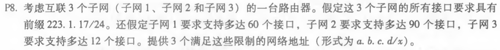
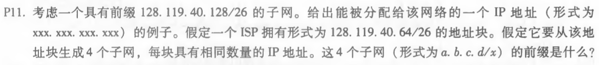
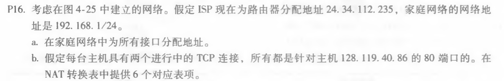
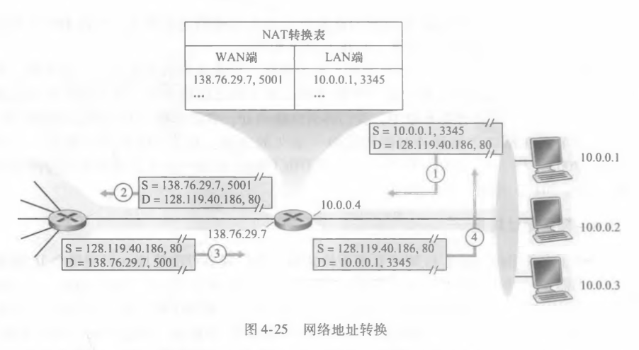

#### 1. P8

因为子网1要求支持60个接口，子网2要求支持90个接口，子网3要求支持12个接口，一共需要支持162个接口。

因此子网地址为：

223.1.17.0/26

223.1.17.128/25

223.1.17.192/28

#### 2. P11

因为要使生成的子网具有相同数量的IP的地址，所以划分为64、80、96、112。因此子网如下：

128.119.40.64/28

128.119.40.80/28

128.119.40.96/28

128.119.40.112/28

#### 3. P16

a. 家庭中三个主机的地址依次为：

192.168.1.1

192.168.1.2

192.168.1.3

路由器的地址为：

192.168.1.4

b. 因为ISP为路由器分配的地址为24.34.112.235，家庭网络的地址为192.168.1。所以WAN端IP地址为24.34.112.235，端口号依次从5000到5005。主机端网络地址为192.168.1，分为三个主机，分别为192.168.1.1、192.168.1.2、192.168.1.3。端口号则从3345开始，同一IP地址下依次加一。

NAT转换表如下：

| WAN端               | LAN端             |
| ------------------- | ----------------- |
| 24.34.112.235, 5000 | 192.168.1.1, 3345 |
| 24.34.112.235, 5001 | 192.168.1.1, 3346 |
| 24.34.112.235, 5002 | 192.168.1.2, 3445 |
| 24.34.112.235, 5003 | 192.168.1.2, 3446 |
| 24.34.112.235, 5004 | 192.168.1.3, 3545 |
| 24.34.112.235, 5005 | 192.168.1.3, 3546 |

