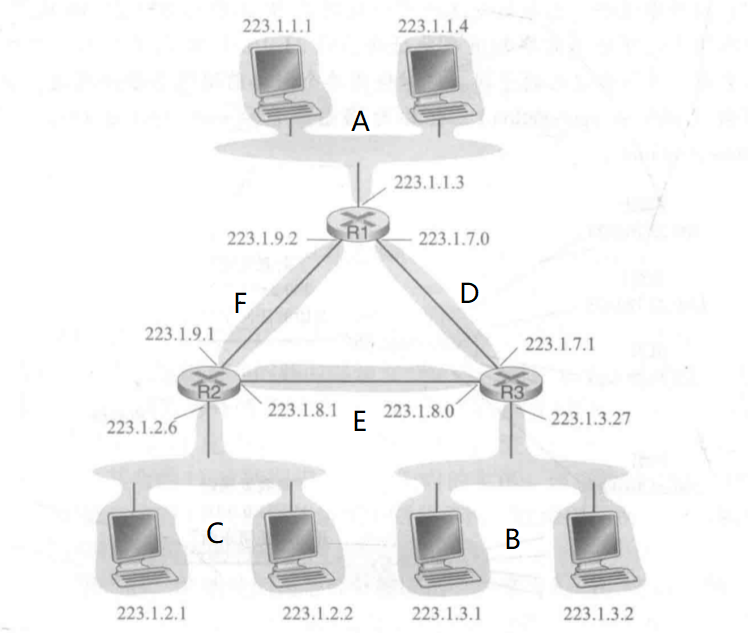

# 第四章练习题

## P12

对图4-20中子网的标记如下图所示：

**a.** 子网A要求具有足够的地址支持250个接口，所以IP地址中至少需要8位（$2^{8}=256$）来识别不同接口，分配的子网掩码为`214.97.254/24`，共256个地址；

子网B要求具有足够的地址支持120个接口，所以IP地址中至少需要7位（$2^{7}=128$）来识别不同接口，分配的子网掩码为`214.97.255.0/25`，共128个地址；

子网C要求具有足够的地址支持120个接口，所以IP地址中至少需要7位（$2^{7}=128$）来识别不同接口，分配的子网掩码为`214.97.254.128/25 - 214.97.254.128/29`，即从`214.97.254.128/25`中去掉`214.97.254.128/29`这8个地址，共120个地址；

子网D、E、F各自要求支持2个接口，所以IP地址中至少需要1位（$2^{1}=2$）来识别不同接口，分配的子网掩码分别为`214.97.254.128/31`、``214.97.254.130/31`、`214.97.254.132/30`。

**b.** 路由器**R1**的转发表为：

|              前缀匹配              | 链路接口 |
| :--------------------------------: | :------: |
|     11010110 01100001 11111110     |  子网A   |
| 11010110 01100001 11111111 1000000 |  子网D   |
| 11010110 01100001 11111111 100001  |  子网F   |

路由器**R2**的转发表为：

|              前缀匹配              | 链路接口 |
| :--------------------------------: | :------: |
|    11010110 01100001 11111110 1    |  子网C   |
| 11010110 01100001 11111111 1000001 |  子网E   |
| 11010110 01100001 11111111 100001  |  子网F   |

路由器**R3**的转发表为：

|              前缀匹配              | 链路接口 |
| :--------------------------------: | :------: |
|    11010110 01100001 11111110 0    |  子网B   |
| 11010110 01100001 11111111 1000000 |  子网D   |
| 11010110 01100001 11111111 1000001 |  子网E   |

## P16

**a.** 图4-25中建立的网络，其中一共有四个接口需要分配地址，家庭网络的子网掩码为`192.168.1/24`，故三个主机的端口地址为：`192.168.1.1`，`192.168.1.2`，`192.168.1.3`，路由器的输出端口为`192.168.1.4`。

**b.** 由于题目中未给定新的端口号，本解中沿用原图中的端口号，NAT转换表为：

|        WAN端        |       LAN端       |
| :-----------------: | :---------------: |
| 24.34.112.235，5001 | 192.168.1.1，3345 |
| 24.34.112.235，5002 | 192.168.1.1，3346 |
| 24.34.112.235，5003 | 192.168.1.2，3355 |
| 24.34.112.235，5004 | 192.168.1.2，3356 |
| 24.34.112.235，5005 | 192.168.1.3，3365 |
| 24.34.112.235，5006 | 192.168.1.3，3366 |

## P22

对于第一种防火墙行为，S2的流表为：

|                 匹配                 |    动作    |
| :----------------------------------: | :--------: |
| IP Src = 10.1.0.1; IP Dst = 10.2.0.3 | Forward(3) |
| IP Src = 10.1.0.1; IP Dst = 10.2.0.4 | Forward(4) |
| IP Src = 10.3.0.6; IP Dst = 10.2.0.3 | Forward(3) |
| IP Src = 10.3.0.6; IP Dst = 10.2.0.4 | Forward(4) |

对于第二种防火墙行为，S2的流表为（**表中#表示为0-255中任意数字**）：

|                      匹配                       |    动作    |
| :---------------------------------------------: | :--------: |
| IP Src = #.#.#.#; IP Dst = 10.2.0.3; port = TCP | Forward(3) |
| IP Src = #.#.#.#; IP Dst = 10.2.0.4; port = TCP | Forward(4) |

对于第三种防火墙行为，S2的流表为（**表中#表示为0-255中任意数字**）：

|                匹配                 |    动作    |
| :---------------------------------: | :--------: |
| IP Src = #.#.#.#; IP Dst = 10.2.0.3 | Forward(3) |

对于第四种防火墙行为，S2的流表为：

|                       匹配                       |    动作    |
| :----------------------------------------------: | :--------: |
| IP Src = 10.1.0.1; IP Dst = 10.2.0.3; port = UDP | Forward(3) |

