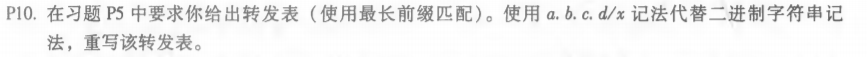
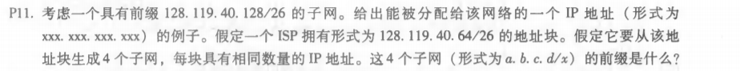
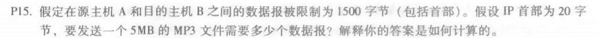

# 第八次作业

徐意 2017312580048

## 课后习题

### P10

> | 224.0/10  | 0    |
> | --------- | ---- |
> | 224.64/16 | 1    |
> | 224/8     | 2    |
> | 225.128/9 | 3    |
> | 其他      | 3    |

### P11

> 子网部分扩展两位，最后两位分别为00，01，10，11
> 128.119.40.64/28
> 128.119.40.80/28
> 128.119.40.96/28
> 128.119.40.112/28

### P15

> TCP首部20字节，IP首部20字节，故每个数据报实际装载了1460字节。
> ⌈(5∗10^6)/1460⌉ = 3425个
